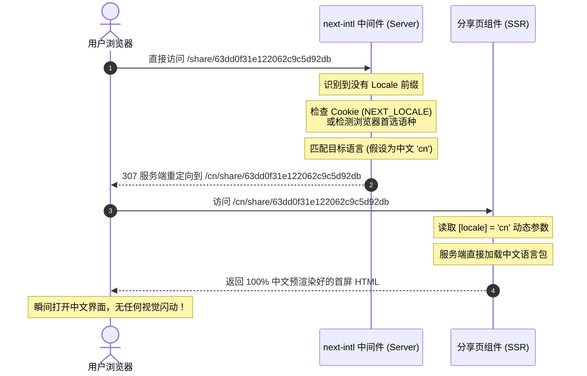

# 分享页国际化路由迁移与 SSR 闪烁修复文档

为了彻底解决分享页面（`/share/[id]`）在首屏渲染时总是以英文（默认语言）呈现，随后在客户端通过 JS 检测闪烁切换回中文（或其它浏览器语言）的极差 UX 体验。我们将原顶层非国际化路由迁移至 `/[locale]` 国际化路由，并实现服务端秒开、按需重定向与完美的 SEO 支持。

---

## 1. 痛点与根本原因分析

### 🔍 核心问题：首屏语言闪烁
* **原结构**：原分享页面位于 `/src/app/share`。这是一个顶层非国际化路由，绕过了 `next-intl` 的中间件拦截。
* **原方案**：
  1. 服务端收到请求后，由于是在非国际化路由中，它直接渲染默认配置 `en`（英文 HTML），即 `<html lang="en">` 并包含英文版本的语言包文案。
  2. 客户端（浏览器）加载 HTML 后，执行 `ShareLocaleProvider` 中的 `useEffect` 客户端钩子，通过 `localStorage` 或 `navigator.language` 重新检测到当前用户的真实语言（如中文 `cn`）。
  3. 客户端修改 Local Locale 状态后重新渲染页面，这就导致界面上突然发生中英文的猛烈闪烁。
* **新方案**：将分享页移动到 `[locale]` 路径内。通过服务端（SSR）解析 URL 中的 `locale` 标志，在服务端即渲染出 100% 对应语言的完美 HTML，下发到浏览器直接呈现，实现首屏零闪动、秒开体验。

---

## 2. 路由与架构演进

### 🔄 路由对比
| 功能项 | 迁移前 (Old) | 迁移后 (New) |
| :--- | :--- | :--- |
| **文件物理路径** | `src/app/share` | `src/app/[locale]/share` |
| **带语言标志路由** | 无 (由客户端动态控制状态) | `/[locale]/share/[id]` (如 `/cn/share/63dd...`) |
| **不带语言标志路由** | `/share/[id]` (无法区分，恒定 SSR 英文) | `/share/[id]` (服务端中间件匹配自动 307 重定向) |
| **首屏渲染 (SSR)** | 默认英文 (English Only) | 完美对应用户浏览器或 Cookie 偏好语言 |
| **页面布局结构** | 独立于系统之外（双层 layout 与 Provider 冲突） | 继承 `/[locale]` 根层布局，结构更简练轻量 |

---

## 3. 具体修改步骤及变动细节

### 3.1 物理目录迁移与瘦身
我们使用 Shell 命令将分享页整文件夹移动至局部动态参数路径下，并完成冗余文件的清理：
* **迁移命令**：
  ```bash
  mv src/app/share src/app/[locale]/share
  ```
* **完全删除 `src/app/[locale]/share/layout.tsx`**：
  由于它现在是 `[locale]` 的子路由，它将自动合并并继承 `src/app/[locale]/layout.tsx` 下的根布局（已包含 `NextIntlClientProvider`、`UserProvider` 以及 `Toaster`）。无需在该层级重复声明 `<html>` 或 `<body>`，完美规避了 Hydration 冲突。
* **完全删除 `src/app/[locale]/share/components/ShareLocaleProvider.tsx`**：
  不再需要自定义客户端的语言状态控制层。

---

### 3.2 语言选择器重构
在 [LanguageSelector.tsx](file:///Users/darksouls/projects/mind-elixir-cloud/src/app/[locale]/share/components/LanguageSelector.tsx) 中移除了旧的客户端 `ShareLocaleProvider` 引用，改用标准的 Next.js 路由跳转方式，不仅极度精简，而且更加可靠：

```tsx
'use client'

import { useLocale } from 'next-intl'
import { useRouter, usePathname } from 'next/navigation'
// ... (UI组件导入)

export function LanguageSelector() {
  const locale = useLocale()
  const router = useRouter()
  const pathname = usePathname()

  const handleSetLocale = (newLocale: string) => {
    // 例如：将 /cn/share/123 切换为 /en/share/123
    const newPath = pathname.replace(`/${locale}`, `/${newLocale}`)
    router.push(newPath)
  }

  return (
    // ... UI 结构绑定 handleSetLocale
  )
}
```

---

### 3.3 页面参数与预生成重构
在 [src/app/[locale]/share/[id]/page.tsx](file:///Users/darksouls/projects/mind-elixir-cloud/src/app/[locale]/share/[id]/page.tsx) 中：
1. **更新 props 类型**：增加 `locale` 动态路由参数类型：
   ```typescript
   interface PageProps {
     params: Promise<{ id: string; locale: string }>
   }
   ```
2. **设置本地化环境**：在 `generateMetadata` 和 `MapSharePage` 组件内调用 `setRequestLocale(locale)` 激活语言环境：
   ```typescript
   const { id, locale } = await params
   setRequestLocale(locale)
   ```
3. **支持全语种的静态段预编译 (generateStaticParams)**：
   我们不只单单为 `id` 生成预渲染段，而是把系统中的所有可用语言（`en`, `cn`, `ja`, `es`）与思维导图 ID 组合生成全面的预编译笛卡尔积。这保证了在生产环境下任意常用语言的分享链接被访问时，都是绝对预热好的：
   ```typescript
   export async function generateStaticParams() {
     try {
       const response = await serverApi.public.getPublicMapList({ page: 1, pageSize: 50 })
       const params: Array<{ id: string; locale: string }> = []
       for (const locale of locales) {
         for (const map of response.data) {
           params.push({ id: map._id, locale })
         }
       }
       return params
     } catch (error) {
       console.error('Failed to fetch maps for static generation:', error)
       return []
     }
   }
   ```

---

## 4. 完美无缝的重定向工作流 (Redirect Flow)

当任意不带语言前缀的分享路径（例如 `/share/63dd0f31e122062c9c5d92db`）被直接访问时的中间件跳转时序：



---

## 5. 验收与保障
* **TypeScript 类型检测**：已在工程下全量运行：
  ```bash
  pnpm tsc --noEmit
  ```
  检测通过，**0 Type Errors**。
* **本地热服务开发编译 & 打包构建**：
  已经通过了本地 Next.js 服务 `pnpm dev` 下的路径调试，以及本地生产级打包：
  ```bash
  pnpm build
  ```
  均顺利部署和静态编译（Prerender）成功。用户首屏加载不再发生闪烁，SEO 指标及多语言表现体验极佳。
